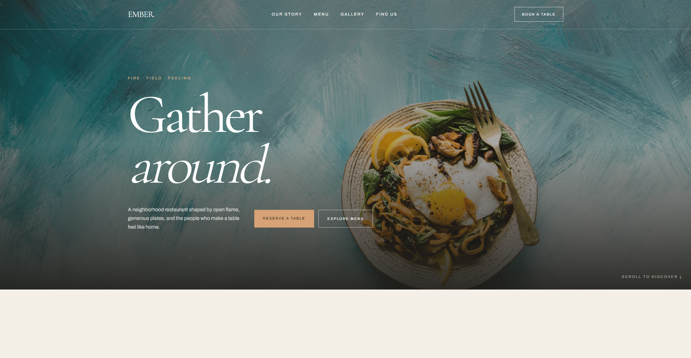

# 🍽️ Restaurant Website

A modern, responsive restaurant website built with **Next.js, TypeScript, and Tailwind CSS**.

This project is part of **Webverox's demo projects**, created to showcase modern web design, frontend development, responsive layouts, and polished user experiences for potential clients and portfolio purposes.

## ✨ Highlights

- Modern and professional restaurant UI
- Fully responsive across desktop, tablet, and mobile
- Clean and intuitive navigation
- Restaurant menu and food showcase
- Reusable and scalable components
- Smooth and interactive user experience
- Modern layouts and visual styling
- Type-safe development with TypeScript
- Responsive styling with Tailwind CSS
- Built with the latest Next.js architecture

## 🛠️ Built With

- **Next.js**
- **TypeScript**
- **Tailwind CSS**

## 🎯 Purpose

This website is a **demo project created by Webverox** for:

- Client demonstrations
- Portfolio presentation
- Design and development showcases
- Exploring modern web experiences
- Displaying potential website solutions for restaurants and food businesses

## 🏢 Built by Webverox

**Webverox** is a web development agency focused on creating modern, responsive, and professional websites for businesses.

This project demonstrates the type of web experience that can be designed and developed for a restaurant or food-related business.

> **Built by [@Webverox](https://github.com/webverox) for demo projects and display purposes. Visit [Webverox](https://webverox.com) for more information**

## 📸 Project Preview

**Live Demo:** [View Restaurant Website](https://restaurant-demo-pink-five.vercel.app/)

## ⚠️ Disclaimer

This is a **demo website created for demonstration and display purposes only**. It is not affiliated with, sponsored by, or officially associated with any real restaurant, brand, or business represented in the design.

---

**© 2026 Webverox — Demo Project**
